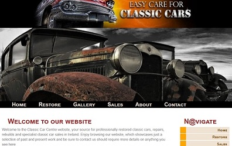

**#Custom Website**

Language: HTML, CSS, JavaScript

Description: The aim of this project was to develop a creative websiste using HTML, CSS, JavaScript, jQuery and XML/JSON while making it more interactive. The Website is based on a particular hobby of mine, which is restoring Classic and Vintage cars. The user for this site would get an education about classic cars, how to restore them with pictures and articles. The aim is to develop a professional and engaging website that will enhance the user experience.

You can visit my site here: [Custom Website](https://jeffreyfarnan.github.io/custom-website.github.io/)
